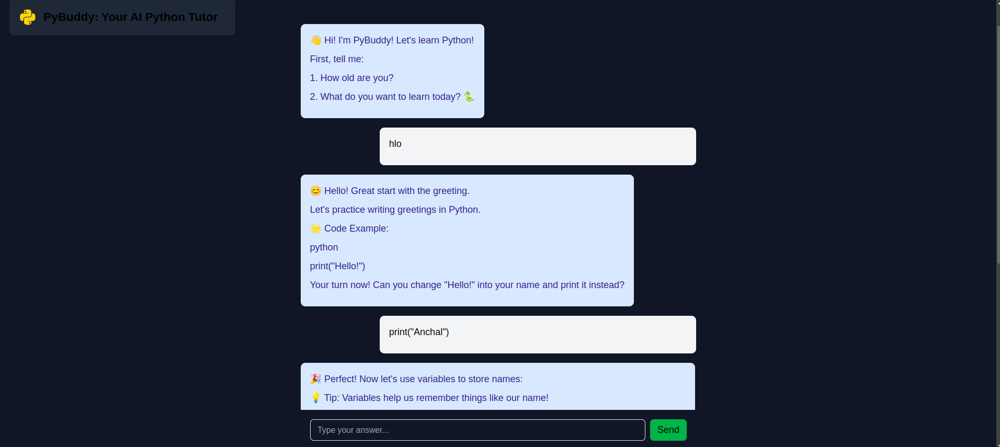
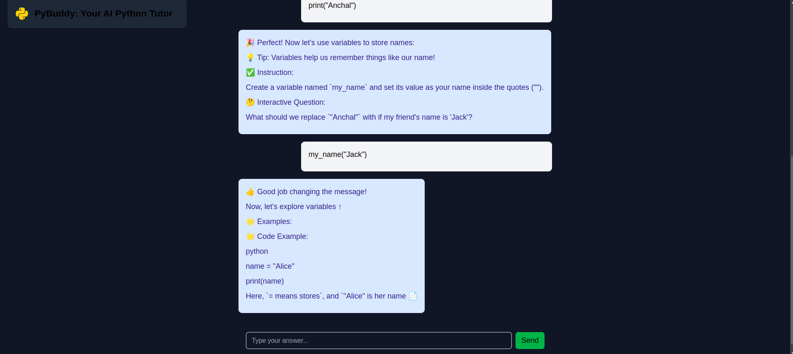

# AI Python Tutor 🐍✨

**An AI-powered learning platform designed to teach children Python programming fundamentals**

> **Assignment Project**  
> *Created as part of an assessment evaluating front-end development, API integration, UX design, and AI prompting skills*

## Screenshots

### Idea Generation Interface


### Detailed Suggestions


---

## Project Overview

This AI-powered tutor helps children aged 8-15 learn Python through:
- Interactive coding lessons
- Adaptive learning paths
- Gamified exercises
- Child-friendly interface
- Real-time code validation

**Core Objective**: Create an engaging learning environment that simplifies Python concepts using AI assistance while maintaining educational effectiveness.


##  Features

### Curriculum-Based Learning 🎯
1. Structured learning path:
   - Printing → Variables → Conditionals → Loops → Functions

### Child-Friendly Design 🌈
- Emoji-enhanced responses
- Dark theme with high contrast
- Simple navigation

### AI Integration 🤖
- Hugging Face's Mistral-Nemo-Instruct-2407 model
- Automated exercise generation

## Technologies Used

- **Frontend**: Next.js, TypeScript, Tailwind CSS
- **Backend**: Next.js API Folder
- **API**: Hugging Face API

## Getting Started

1. **Clone the repository** :
    ```bash
    git clone https://github.com/AnchalDevBytes/python-tutor.git
    ```

2. **Install dependencies** :
    ```bash
    npm install
    ```

3. **Configure Environment Variables** :
    ```bash
    HUGGING_FACE_API_KEY="your hugging face api key"
    ```

4. **Run the development server** :
    ```bash
    npm run dev
    ```

5. Open [http://localhost:3000](http://localhost:3000) in your browser.

## Deployment

Deployed on Vercel: [Live](https://python-tutor-virid.vercel.app/)
